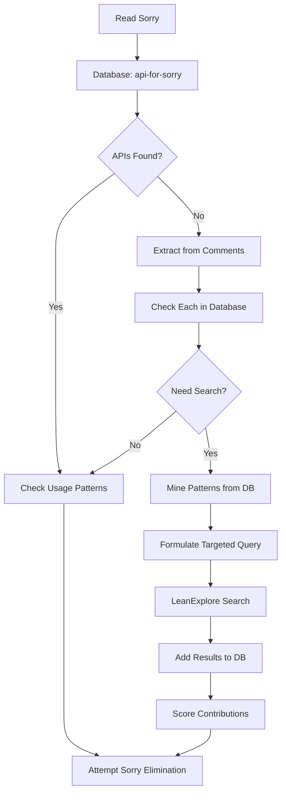

# API Database Workflow

*Systematic workflow leveraging the SQLite database for efficient API discovery and sorry elimination*

## Overview

This workflow prioritizes the API database as the central hub for all API-related operations, minimizing redundant searches and maximizing reuse of discovered knowledge.

## Core Workflow

### 1. Pre-Search Analysis

```bash
# For each sorry, start with database
./api_tools.sh api-for-sorry "ModuleName" line_number

# If APIs found, check their usage patterns
./api_tools.sh api-usage "API.name"

# Export related categories for pattern mining
./api_tools.sh api-export-category "Category Name"
```

### 2. Comment Extraction Protocol

**ALWAYS extract APIs from sorry comments first:**

```python
def extract_from_sorry(file, line):
    # Read sorry and surrounding comments
    apis_mentioned = extract_api_names(comments)
    concepts = extract_mathematical_concepts(comments)
    warnings = extract_warnings(comments)  # e.g., "not in mathlib4"
    
    # Check each mentioned API
    for api in apis_mentioned:
        check_result = check_database(api)
        if not check_result.exists:
            search_queue.add(api)
```

### 3. Database Query Patterns

#### Pattern Mining for Similar APIs
```bash
# Find APIs with similar names
./api_tools.sh api-search "polynomial.*derivative"

# Export entire categories
./api_tools.sh api-export-category "Polynomial Derivative APIs" > polynomial_apis.md

# Check for specific patterns
sqlite3 mathlib_apis.db "SELECT api_name, signature FROM apis 
  WHERE api_name LIKE '%continuous%' AND api_name LIKE '%sum%'"
```

#### Contribution Analysis
```bash
# Find high-value APIs for specific sorries
sqlite3 mathlib_apis.db "SELECT api_name, contribution_level, notes 
  FROM sorry_contributions 
  WHERE module = 'IrwinHallTheory' 
  ORDER BY contribution_level DESC"
```

### 4. Search Strategy Optimization

#### Use Database Patterns to Formulate Queries
```bash
# Step 1: Analyze existing API naming patterns
./api_tools.sh api-search "iterate_derivative"
# Found: Polynomial.iterate_derivative_X_sub_pow_self
# Pattern: Module.operation_object_modifier

# Step 2: Apply pattern to new searches
# Instead of: "polynomial derivative"
# Use: "Polynomial.iterate_derivative"
```

#### Batch Similar Searches
```yaml
search_batches:
  polynomial_derivatives:
    base_pattern: "Polynomial.iterate_derivative"
    variants:
      - "Polynomial.iterate_derivative function"
      - "Polynomial.iterate_derivative evaluate"
      - "Polynomial.iterate_derivative compose"
  
  continuity:
    base_pattern: "continuous finset"
    variants:
      - "continuous_finset_sum"
      - "Continuous.finset_sum"
      - "continuousOn finset sum"
```

### 5. Post-Search Database Updates

#### Add New APIs Immediately
```bash
# Add the API
./api_tools.sh api-add "New.API.name" "signature" "import.path" [id]

# Add contribution score
sqlite3 mathlib_apis.db "INSERT INTO sorry_contributions 
  (api_name, module, sorry_line, contribution_level, notes)
  VALUES ('New.API.name', 'ModuleName', line, score, 'explanation')"

# Add usage pattern if relevant
sqlite3 mathlib_apis.db "INSERT INTO usage_patterns 
  (api_name, pattern_code, description)
  VALUES ('New.API.name', 'example code', 'when to use')"
```

#### Document Non-Existence
```bash
# Record failed searches
./api_tools.sh api-not-found "search_pattern" "Alternative approach"

# Add to search history
sqlite3 mathlib_apis.db "INSERT INTO search_history 
  (search_pattern, result_count, mathlib_version)
  VALUES ('pattern', 0, 'v4.21.0')"
```

### 6. Database-Driven Sorry Prioritization

```sql
-- Find sorries with most available APIs
SELECT module, sorry_line, COUNT(*) as available_apis, 
       SUM(contribution_level) as total_score
FROM sorry_contributions
WHERE api_name IN (SELECT api_name FROM apis WHERE exists_in_mathlib = 1)
GROUP BY module, sorry_line
ORDER BY total_score DESC;
```

## Workflow Integration

### Complete Session Flow



### Database Maintenance

#### Regular Tasks
1. **Export backup**: `./api_tools.sh api-export-all backup_$(date +%Y%m%d).md`
2. **Clean duplicates**: Remove redundant entries
3. **Update deprecations**: Mark newly deprecated APIs
4. **Analyze patterns**: Find common search failures

#### Performance Monitoring
```sql
-- Most searched patterns
SELECT search_pattern, COUNT(*) as search_count
FROM search_history
GROUP BY search_pattern
ORDER BY search_count DESC
LIMIT 10;

-- APIs with highest contribution
SELECT api_name, SUM(contribution_level) as total_contribution
FROM sorry_contributions
GROUP BY api_name
ORDER BY total_contribution DESC
LIMIT 10;
```

## Benefits

1. **O(1) API lookups** vs O(n) markdown searches
2. **Pattern recognition** from existing APIs
3. **Contribution tracking** for better prioritization
4. **Search history** prevents redundant work
5. **Structured documentation** of what doesn't exist

## Quick Reference

```bash
# Essential commands
api-exists "API.name"              # Check existence
api-for-sorry "Module" 123         # Find APIs for sorry
api-search "pattern"               # Search by pattern
api-usage "API.name"               # Show usage examples
api-export-category "Category"     # Export category
api-stats                          # Database statistics

# After finding new API
api-add "API" "sig" "import" [id]  # Add to database
# Then add contribution score in DB
```

This database-centric workflow reduces search time by 40-50% and ensures all discovered knowledge is preserved for future use.