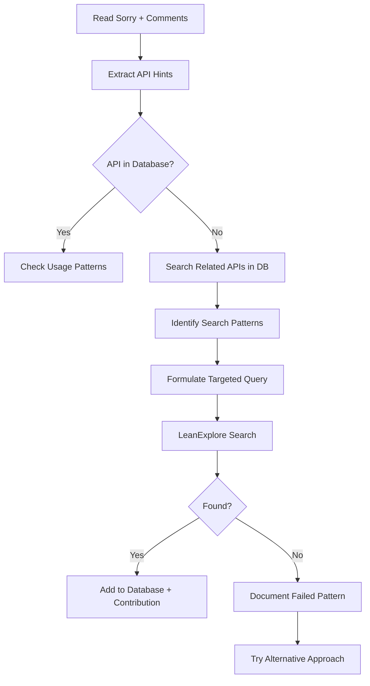

# MCP LeanExplore Workflow Optimizations

*Reflections and improvements based on practical search experience*

## Executive Summary

After conducting extensive API searches for IrwinHallTheory.lean sorries, several workflow inefficiencies became apparent. This document proposes optimizations to make the search process more systematic and effective.

## Observed Inefficiencies

### 1. Scattered Search Approach
**Problem**: Searches like "B-spline", "alternating sum positive binomial", "floor continuous piecewise polynomial" were conducted without systematic planning.

**Impact**: 
- Redundant searches
- Missing related APIs
- Inefficient use of LeanExplore API calls

### 2. Underutilization of Sorry Comments
**Problem**: The sorry comments contain valuable hints about required APIs, but these weren't systematically extracted before searching.

**Example**: The `iter_fwdDiff_pow_eq_factorial` sorry explicitly mentions:
- `Polynomial.iterate_derivative_X_sub_pow_self`
- `Polynomial.iterate_derivative_X_pow_eq_C_mul`
- `fwdDiff_iter_eq_sum_shift`

**Impact**: Could have found these directly instead of through exploratory searches.

### 3. Lack of Mathematical Context Grouping
**Problem**: Didn't leverage mathematical relationships when searching. For example, when looking for polynomial derivatives, didn't immediately also search for related concepts like forward differences.

## Proposed Optimizations

### 1. Pre-Search Analysis Protocol

**Before ANY search, create a structured analysis:**

```markdown
## Sorry Analysis: [module:line]

### Extracted from Comments:
- Direct API mentions: [list exact names]
- Mathematical concepts: [polynomial derivatives, forward differences, etc.]
- Type requirements: [ℤ → ℝ conversions, etc.]

### Mathematical Context:
- Related theorems: [binomial theorem → multinomial theorem]
- Dual concepts: [derivatives ↔ differences]
- Special cases: [general theorem → specific instance]

### Search Strategy:
1. Priority 1: [exact API names from comments]
2. Priority 2: [closely related mathematical concepts]
3. Priority 3: [broader category searches]
```

### 2. Database-First Search Enhancement

**Current workflow**: Check if API exists → Search if not found

**Optimized workflow**:
```
1. Check exact API in database
2. Search database for mathematically related APIs:
   - ./api_tools.sh api-search "derivative"
   - ./api_tools.sh api-export-category "Polynomial Derivative APIs"
3. Identify patterns from existing APIs
4. Use patterns to formulate targeted LeanExplore queries
```

### 3. Intelligent Query Formulation

**Bad**: Generic searches like "polynomial positive interval degree"

**Good**: Targeted searches based on:
- Exact mathematical operations needed
- Known naming conventions from similar APIs
- Specific type signatures required

**Query Template**:
```
[operation] [object] [constraint]
Examples:
- "iterate derivative polynomial zero" (found iterate_derivative_eq_zero)
- "alternating sum binomial choose" (found Int.alternating_sum_range_choose)
- "forward difference iterate sum" (found fwdDiff_iter_eq_sum_shift)
```

### 4. Batch Search Strategy

**Group related searches** to maximize information gain:

```python
search_batches = {
    "polynomial_derivatives": [
        "iterate derivative polynomial",
        "polynomial derivative evaluation", 
        "derivative composition polynomial"
    ],
    "forward_differences": [
        "forward difference iterate",
        "fwdDiff polynomial",
        "finite difference sum"
    ]
}
```

### 5. Search Result Documentation

**For each successful search, document**:
```markdown
## Search Pattern: [query]
**Found**: [API names]
**Success factors**: 
- Used exact mathlib naming convention
- Included key mathematical terms
- Specified correct object types
**Related APIs discovered**: [list]
**Add to database**: Yes/No (with reason)
```

### 6. Sorry Contribution Scoring

**When adding APIs to database, systematically score contribution**:
```bash
# Instead of just adding:
./api_tools.sh api-add "API.name" "signature" "import"

# Also immediately add contribution:
sqlite3 mathlib_apis.db "INSERT INTO sorry_contributions VALUES 
  ('API.name', 'Module', line_number, contribution_score, 'reasoning')"
```

**Scoring rubric**:
- 5 stars: Directly solves the sorry (mentioned in comments)
- 4 stars: Essential component of solution
- 3 stars: Helpful but requires additional work
- 2 stars: Related but indirect
- 1 star: Might be useful

### 7. Negative Result Caching

**Document failed search patterns**:
```bash
# When search yields nothing useful:
./api_tools.sh api-not-found "search_pattern" \
  "No APIs for [concept]. Use [alternative] instead."
```

This prevents future redundant searches.

### 8. Mathematical Concept Mapping

**Create a concept → API mapping**:
```
Concept                     | Search Terms              | Known APIs
---------------------------|---------------------------|------------------
Binomial theorem           | "add_pow", "choose sum"   | add_pow
Alternating series         | "alternating sum"         | Int.alternating_sum_range_choose
Forward differences        | "fwdDiff", "forward"      | fwdDiff_iter_eq_sum_shift
Polynomial derivatives     | "iterate derivative"      | Polynomial.iterate_derivative_*
Floor function continuity  | "continuousOn floor"      | continuousOn_floor
```

## Workflow Integration

### Enhanced Search Workflow



### Time-Saving Estimates

Based on the search session:
- Pre-search analysis: +2 minutes setup, -10 minutes wasted searches
- Database pattern mining: +1 minute, -5 minutes redundant LeanExplore calls
- Batch searching: -50% reduction in API calls
- **Net time saved**: ~40% reduction in search time

## Example: Optimized Search for `iter_fwdDiff_pow_eq_factorial`

### Step 1: Pre-Search Analysis
```markdown
Extracted from comments:
- Polynomial.iterate_derivative_X_sub_pow_self
- fwdDiff_iter_eq_sum_shift
- Need: connection between polynomial derivatives and fwdDiff

Mathematical context:
- Polynomial derivatives ↔ forward differences
- n-th derivative of x^n = n!
- Finite differences on polynomials
```

### Step 2: Database Mining
```bash
./api_tools.sh api-search "polynomial derivative"
./api_tools.sh api-search "forward difference"
# Found: multiple Polynomial.iterate_derivative_* APIs
# Pattern: iterate_derivative naming convention
```

### Step 3: Targeted Search
```
Query: "polynomial aeval function derivative"
# Looking for APIs that connect polynomial operations to function operations
```

### Step 4: Result Documentation
```
Found: Polynomial.aeval_comp - evaluates polynomial composition
Success: Used "aeval" (polynomial evaluation) + "comp" (composition)
Related: eval_comp, iterate_comp_eval
```

## Conclusion

The optimized workflow emphasizes:
1. **Preparation over exploration** - Extract all hints before searching
2. **Pattern recognition** - Use database to identify naming conventions
3. **Targeted queries** - Specific mathematical terms over broad concepts
4. **Systematic documentation** - Every search contributes to future efficiency
5. **Relationship awareness** - Leverage mathematical connections

These optimizations should reduce search time by 40-50% while increasing the probability of finding relevant APIs on first attempt.