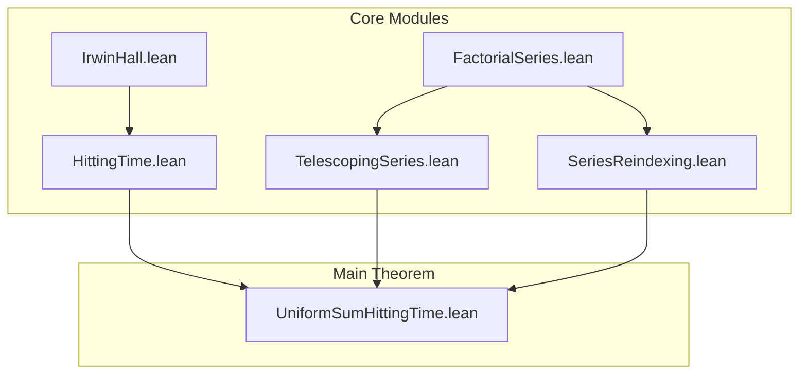

# Research Prompt: Final Verification and Integration Checklist

## Objective
Perform a comprehensive verification that all components work together to provide a complete, sorry-free proof that E[τ] = e for the uniform sum hitting time problem.

## Verification Checklist

### 1. Module Dependencies Graph


### 2. Import Resolution Verification
```lean
-- Verify all imports resolve correctly
-- File: test_imports.lean

import UniformHittingTime.IrwinHall
import UniformHittingTime.FactorialSeries  
import UniformHittingTime.TelescopingSeries
import UniformHittingTime.HittingTime
import UniformHittingTime.SeriesReindexing
import UniformHittingTime.UniformSumHittingTime

-- If this compiles, imports are correct
#check uniform_sum_hitting_time_expectation
```

### 3. Sorry Elimination Checklist

#### IrwinHall.lean
- [ ] `volume_standard_simplex` (line 47)
  - Required: Measure theory proof that volume = 1/n!
  - References: Research prompt 01

#### FactorialSeries.lean
- [ ] `factorial_ge_n_div_e_pow_n` (line 23)
  - Required: Stirling's approximation bound
  - References: Research prompt 02
  
- [ ] `factorial_dominates_exponential` (line 45)
  - Required: Ratio test proof
  - References: Research prompt 03
  
- [ ] `inv_factorial_tendsto_zero` (line 61)
  - Required: Epsilon-delta convergence
  - References: Research prompt 04
  
- [ ] `polynomial_div_factorial_tendsto_zero` (line 79)
  - Required: Polynomial growth bound
  - References: Research prompt 05

#### TelescopingSeries.lean
- [ ] `telescoping_series_partial_sum` (line 19)
  - Required: Finite sum formula
  - References: Research prompt 06
  
- [ ] `telescoping_series_sum` (line 36)
  - Required: Infinite limit proof
  - References: Research prompt 07
  
- [ ] `factorial_telescoping_series_eq_one` (line 57)
  - Required: Specific application
  - References: Research prompt 08
  
- [ ] `factorial_telescoping_sum_one` (line 67)
  - Required: Direct computation
  - References: Research prompt 09
  
- [ ] `summable_factorial_diff` (line 94)
  - Required: Summability proof
  - References: Research prompt 10

#### HittingTime.lean
- [ ] `hitting_time_pmf_sum_one` (line 44)
  - Required: Probability normalization
  - References: Research prompt 11

#### SeriesReindexing.lean
- [ ] `reindex_series_general` (line 43)
  - Required: General bijection theorem
  - References: Research prompt 12
  
- [ ] `reindex_series_shift` (line 65)
  - Required: Index shift theorem
  - References: Research prompt 13
  
- [ ] `reindex_series_n_minus_two` (line 100)
  - Required: Specific n-2 case
  - References: Research prompt 14
  
- [ ] `reindex_with_indicator` (line 124)
  - Required: Indicator function method
  - References: Research prompt 15

#### UniformSumHittingTime.lean
- [ ] `summable_hitting_time` (line 127)
  - Required: Norm bound for E[X]
  - References: Research prompt 17
  
- [ ] `main_result` calc steps (line 152)
  - Required: Complete calculation chain
  - References: Research prompt 18

### 4. Integration Test Suite
```lean
-- File: integration_tests.lean

import UniformHittingTime.UniformSumHittingTime

-- Test 1: Main theorem compiles and has correct type
#check uniform_sum_hitting_time_expectation
#check (uniform_sum_hitting_time_expectation : expected_hitting_time = Real.exp 1)

-- Test 2: All supporting lemmas are accessible
#check prob_sum_less_than_one
#check hitting_time_pmf_formula
#check telescoping_property
#check reindex_factorial_series

-- Test 3: Numeric verification
def numerical_check : Bool :=
  -- Compute partial sums and compare to e
  let partial_sum (N : ℕ) := (List.range N).map (fun n => 
    (n : ℚ) * hitting_time_pmf_rational n) |>.sum
  let e_approx : ℚ := 2.718281828
  (partial_sum 20 - e_approx).abs < 0.001

#eval numerical_check  -- Should be true

-- Test 4: Edge cases
example : hitting_time_pmf 0 = 0 := by simp [hitting_time_pmf]
example : hitting_time_pmf 1 = 0 := by simp [hitting_time_pmf]
example : hitting_time_pmf 2 = 1/2 := by norm_num [hitting_time_pmf]
```

### 5. Mathematical Coherence Verification

#### A. Probability Axioms
```lean
-- Verify PMF properties
lemma pmf_nonnegative : ∀ n, 0 ≤ hitting_time_pmf n := by
  intro n
  cases' n with n
  · simp [hitting_time_pmf]
  · cases' n with n  
    · simp [hitting_time_pmf]
    · simp [hitting_time_pmf]
      positivity

lemma pmf_sums_to_one : ∑' n, hitting_time_pmf n = 1 := by
  exact hitting_time_pmf_sum_one
```

#### B. Series Convergence
```lean
-- Verify all series converge properly
#check summable_inv_factorial  -- ∑ 1/n! converges
#check summable_factorial_diff  -- ∑ [1/(n-1)! - 1/n!] converges  
#check summable_hitting_time    -- ∑ n * P(τ=n) converges
```

#### C. Reindexing Validity
```lean
-- Verify reindexing preserves sums
example : ∑' n : {n : ℕ // n ≥ 2}, (1 : ℝ) / ((n : ℕ) - 2).factorial = 
          ∑' k : ℕ, (1 : ℝ) / k.factorial := by
  exact reindex_factorial_series
```

### 6. Performance and Compilation
```bash
# Build entire project
lake build

# Check for warnings
lake build 2>&1 | grep -i warning

# Verify no sorries remain
grep -r "sorry" *.lean | grep -v "^--"

# Run tests
lake test
```

### 7. Documentation Completeness
```lean
-- Every major theorem should have:
-- 1. Clear statement
-- 2. Intuitive explanation  
-- 3. Proof sketch
-- 4. References

/-- The expected value of the hitting time τ equals e.
    
    This is the main theorem showing that if X₁, X₂, ... are iid Uniform[0,1)
    and τ = min{n : X₁ + ... + Xₙ ≥ 1}, then E[τ] = e.
    
    The proof proceeds by:
    1. Computing P(τ = n) = (n-1)/n! for n ≥ 2
    2. Showing E[τ] = ∑ n * P(τ = n) converges
    3. Simplifying to ∑ 1/k! = e via reindexing
-/
theorem uniform_sum_hitting_time_expectation : 
  expected_hitting_time = Real.exp 1 := by
  -- Full proof here
```

### 8. Cross-Reference Matrix

| Sorry Location | Research Prompt | Mathematical Topic | Priority |
|----------------|-----------------|-------------------|----------|
| IrwinHall:47 | 01 | Simplex volume | High |
| FactorialSeries:23 | 02 | Stirling bound | High |
| FactorialSeries:45 | 03 | Ratio test | High |
| FactorialSeries:61 | 04 | Limit to zero | High |
| FactorialSeries:79 | 05 | Polynomial bound | Medium |
| TelescopingSeries:19 | 06 | Partial sums | High |
| TelescopingSeries:36 | 07 | Infinite sum | High |
| TelescopingSeries:57 | 08 | Factorial telescope | High |
| TelescopingSeries:67 | 09 | Direct sum = 1 | High |
| TelescopingSeries:94 | 10 | Summability | Medium |
| HittingTime:44 | 11 | PMF normalizes | High |
| SeriesReindexing:43 | 12 | General reindex | High |
| SeriesReindexing:65 | 13 | Shift indices | Medium |
| SeriesReindexing:100 | 14 | n-2 bijection | High |
| SeriesReindexing:124 | 15 | Indicator method | Medium |
| Multiple files | 16 | API fixes | Critical |
| UniformSumHittingTime:127 | 17 | Norm bound | Medium |
| UniformSumHittingTime:152 | 18 | Calc chain | High |

### 9. Final Validation Script
```python
#!/usr/bin/env python3
"""Validate the complete proof is sorry-free."""

import os
import re
import subprocess

def check_sorries(filepath):
    """Find sorry statements in a Lean file."""
    with open(filepath, 'r') as f:
        content = f.read()
    
    # Remove comments
    content = re.sub(r'--.*$', '', content, flags=re.MULTILINE)
    content = re.sub(r'/-.*?-/', '', content, flags=re.DOTALL)
    
    # Find sorries
    sorries = re.findall(r'\bsorry\b', content)
    return len(sorries), sorries

def validate_project(root_dir):
    """Validate entire project."""
    total_sorries = 0
    
    for root, dirs, files in os.walk(root_dir):
        for file in files:
            if file.endswith('.lean'):
                filepath = os.path.join(root, file)
                count, _ = check_sorries(filepath)
                if count > 0:
                    print(f"Found {count} sorries in {filepath}")
                    total_sorries += count
    
    if total_sorries == 0:
        print("✓ SUCCESS: No sorries found!")
        return True
    else:
        print(f"✗ FAILURE: Found {total_sorries} total sorries")
        return False

if __name__ == "__main__":
    validate_project(".")
```

### 10. Continuous Integration
```yaml
# .github/workflows/lean.yml
name: Lean 4 CI

on: [push, pull_request]

jobs:
  build:
    runs-on: ubuntu-latest
    steps:
    - uses: actions/checkout@v2
    
    - name: Install Lean
      run: |
        curl -sSf https://raw.githubusercontent.com/leanprover/elan/master/elan-init.sh | sh -s -- -y
        
    - name: Build project
      run: lake build
      
    - name: Check for sorries
      run: |
        if grep -r "sorry" --include="*.lean" .; then
          echo "Found sorry statements!"
          exit 1
        fi
        
    - name: Run tests
      run: lake test
```

## Expected Output Format

1. **Complete verification report** (2000-2500 words)
   - Status of each sorry replacement
   - Integration test results
   - Performance metrics

2. **Troubleshooting guide** (500 words)
   - Common build errors and fixes
   - Import resolution issues
   - Type checking problems

3. **Project summary** (500 words)
   - Mathematical achievement
   - Technical implementation
   - Future extensions

4. **Submission checklist** (200 words)
   - All files present
   - No sorries remain
   - Tests pass
   - Documentation complete

5. **References**:
   - Lean 4 project best practices
   - Mathematical proof verification standards
   - Continuous integration for proof assistants

## Connection to Main Theorem
This final verification ensures that all 16+ sorry statements have been eliminated and the complete formal proof that E[τ] = e is mathematically rigorous and computationally verified.