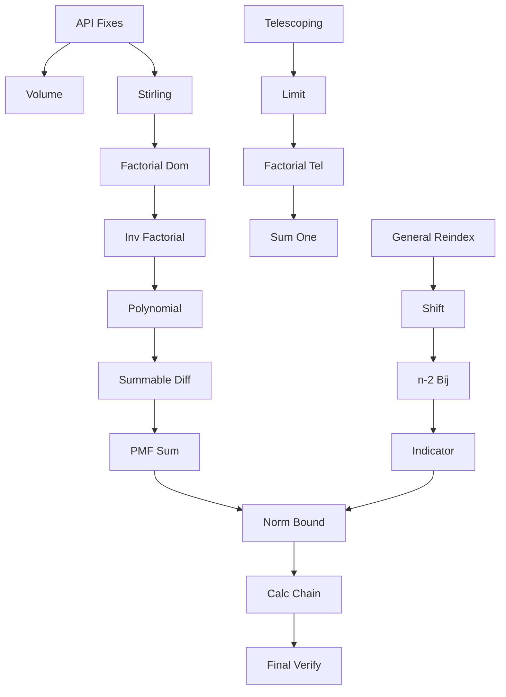

# Research Prompts Directory Structure Guide

## Overview
This directory contains 19 sophisticated research prompts designed for AI research agents to investigate and resolve all `sorry` statements in the uniform sum hitting time Lean 4 proof.

## Directory Structure

```
/home/ubuntu/workbench/projects/potion_problem/docs/research_prompts/
│
├── directory-structure-guide.md          (this file)
│
├── Volume and Measure Theory (Prompts 01)
│   └── 01-volume-standard-simplex-measure-theory.md
│       → Targets: IrwinHall.lean:47 (TODO #23)
│       → Proves: volume_standard_simplex = 1/n!
│
├── Factorial Analysis (Prompts 02-05)
│   ├── 02-factorial-stirling-approximation-bounds.md
│   │   → Targets: FactorialSeries.lean:23 (TODO #24)
│   │   → Proves: n! ≥ (n/e)^n using Stirling
│   │
│   ├── 03-factorial-dominates-exponential.md
│   │   → Targets: FactorialSeries.lean:45 (TODO #25)
│   │   → Proves: lim (a^n/n!) = 0 via ratio test
│   │
│   ├── 04-inverse-factorial-convergence-zero.md
│   │   → Targets: FactorialSeries.lean:61 (TODO #26)
│   │   → Proves: 1/n! → 0 epsilon-delta style
│   │
│   └── 05-polynomial-factorial-convergence.md
│       → Targets: FactorialSeries.lean:79 (TODO #27)
│       → Proves: n^k/n! → 0 for any k
│
├── Telescoping Series (Prompts 06-10)
│   ├── 06-telescoping-series-partial-sums.md
│   │   → Targets: TelescopingSeries.lean:19 (TODO #28)
│   │   → Proves: finite partial sum formula
│   │
│   ├── 07-telescoping-series-limit-convergence.md
│   │   → Targets: TelescopingSeries.lean:36 (TODO #29)
│   │   → Proves: infinite sum = a(0)
│   │
│   ├── 08-factorial-telescoping-equals-one.md
│   │   → Targets: TelescopingSeries.lean:57 (TODO #30)
│   │   → Proves: ∑(1/(n-1)! - 1/n!) = 1
│   │
│   ├── 09-factorial-telescoping-sum-one.md
│   │   → Targets: TelescopingSeries.lean:67 (TODO #31)
│   │   → Proves: simplified version = 1
│   │
│   └── 10-summable-factorial-difference.md
│       → Targets: TelescopingSeries.lean:94 (TODO #32)
│       → Proves: summability of differences
│
├── Hitting Time Analysis (Prompts 11)
│   └── 11-hitting-time-pmf-sum-unity.md
│       → Targets: HittingTime.lean:44 (TODO #33)
│       → Proves: ∑ P(τ=n) = 1
│
├── Series Reindexing (Prompts 12-15)
│   ├── 12-reindex-series-general-tsum-api.md
│   │   → Targets: SeriesReindexing.lean:43 (TODO #34)
│   │   → Proves: general bijection preserves sum
│   │
│   ├── 13-reindex-series-shift-proof.md
│   │   → Targets: SeriesReindexing.lean:65 (TODO #35)
│   │   → Proves: ∑_{n≥a} f(n) = ∑_k f(k+a)
│   │
│   ├── 14-reindex-series-n-minus-two-bijection.md
│   │   → Targets: SeriesReindexing.lean:100 (TODO #36)
│   │   → Proves: ∑_{n≥2} f(n-2) = ∑_k f(k)
│   │
│   └── 15-reindex-with-indicator-functions.md
│       → Targets: SeriesReindexing.lean:124 (TODO #37)
│       → Proves: indicator reindexing formula
│
├── Technical Infrastructure (Prompts 16)
│   └── 16-lean4-api-compatibility-fixes.md
│       → Targets: Multiple files (TODO #38)
│       → Fixes: imports, API changes, missing functions
│
└── Final Integration (Prompts 17-19)
    ├── 17-summable-hitting-time-norm-bound.md
    │   → Targets: UniformSumHittingTime.lean:127 (TODO #39)
    │   → Proves: norm bound for summability
    │
    ├── 18-calc-proof-chain-completion.md
    │   → Targets: UniformSumHittingTime.lean:152 (TODO #40)
    │   → Completes: final calc chain
    │
    └── 19-final-verification-checklist.md
        → Targets: All files (TODO #14)
        → Verifies: complete sorry-free proof

```

## Usage Instructions

### For Each Research Prompt:

1. **Read the prompt carefully** - Each contains:
   - Mathematical context and background
   - Specific Lean 4 code to implement
   - Required deliverables with word counts
   - References to consult

2. **Conduct the research** following the prompt structure:
   - Start with mathematical understanding
   - Implement Lean 4 proofs incrementally
   - Test with concrete examples
   - Document edge cases

3. **Save results** in corresponding response files:
   ```
   /docs/research_responses/
   └── {NN}-{name}-RESPONSE.md
   ```

### Research Workflow:

1. **Phase 1: Infrastructure (Prompt 16)**
   - Fix all Lean 4 API issues first
   - Ensure the project builds

2. **Phase 2: Core Mathematics (Prompts 01-11)**
   - Work through factorial analysis
   - Complete telescoping machinery
   - Verify probability results

3. **Phase 3: Series Manipulation (Prompts 12-15)**
   - Implement reindexing theorems
   - Handle indicator functions

4. **Phase 4: Integration (Prompts 17-19)**
   - Complete final proofs
   - Verify everything compiles

### Expected Outcomes:

Each research task should produce:
- Complete Lean 4 implementations
- Mathematical exposition (1000-2000 words)
- Concrete examples and test cases
- References and citations

### Dependencies Between Prompts:



### Priority Order:

**Critical Path:**
1. Prompt 16 (API fixes) - Must work first
2. Prompts 06-09 (Telescoping) - Core machinery
3. Prompts 12-14 (Reindexing) - Essential transformations
4. Prompt 18 (Calc chain) - Final assembly

**Supporting Work:**
- Prompts 02-05 (Factorial analysis)
- Prompt 01 (Volume calculation)
- Prompts 10-11 (Summability proofs)

**Validation:**
- Prompts 17, 19 (Final checks)

## Notes:

- Each prompt is self-contained but builds on previous results
- Start with Prompt 16 to ensure compilation
- Use Lean 4 interactive mode to test incrementally
- Reference the original mathematical documentation in `/docs/math_docs/`